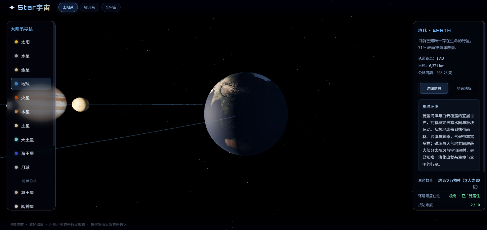
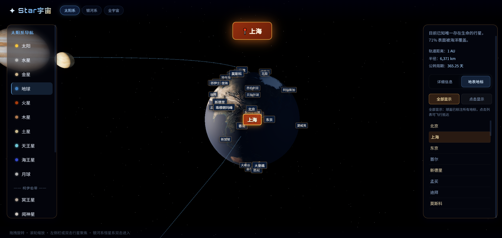
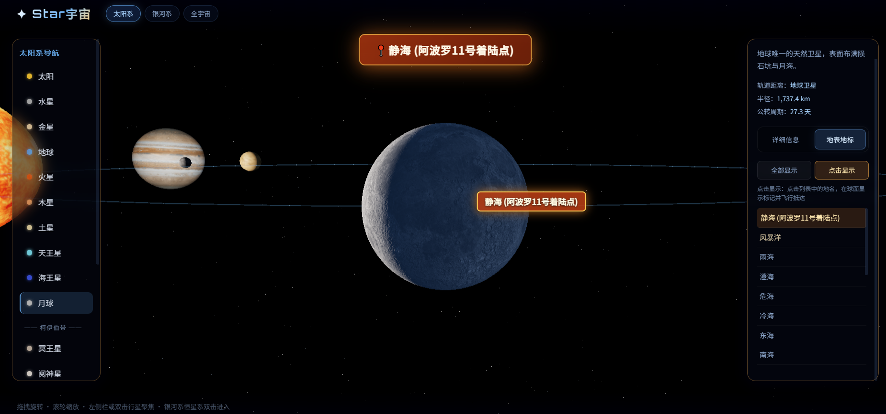
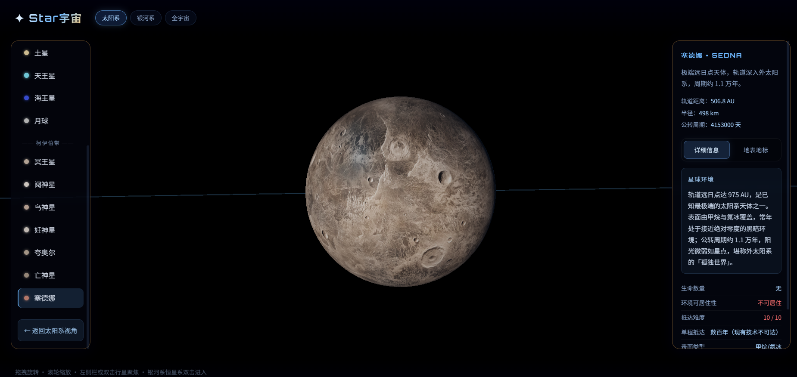
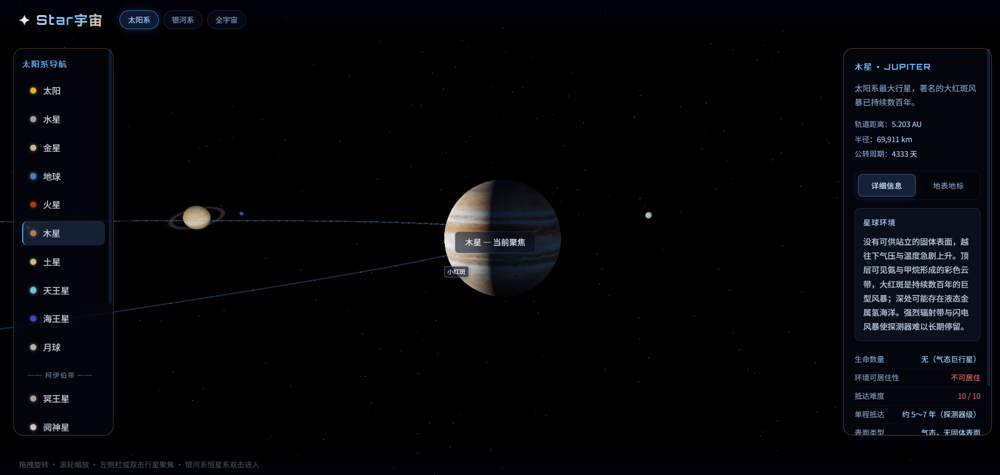
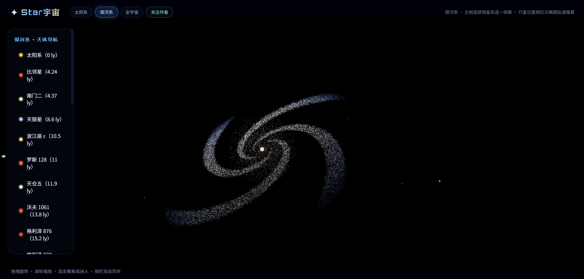
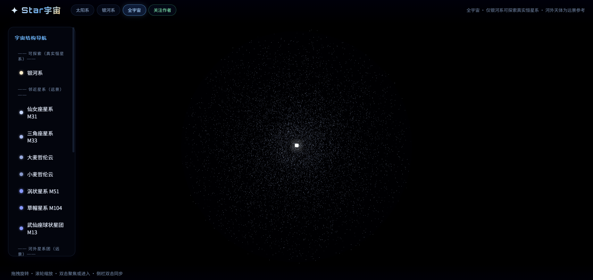
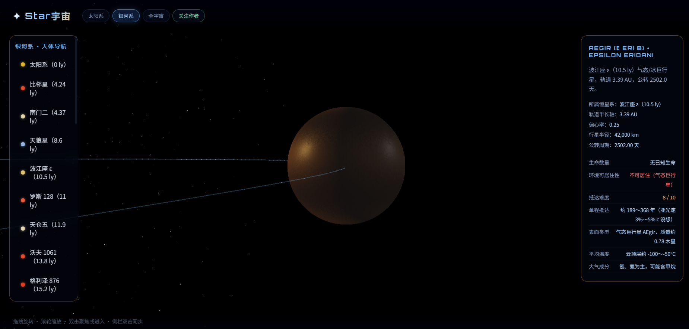

# Star宇宙

基于 **Three.js** 的浏览器端 3D 宇宙漫游：太阳系、银河系与全宇宙多尺度导航，真实纹理、椭圆轨道推算、系外恒星系与地表地标。

[](https://mlqj32.github.io/star-universe/)
[](https://space.bilibili.com/259516939)

## 功能概览

- **太阳系**：八大行星 + 月球 + 柯伊伯带矮行星，J2000 椭圆轨道实时位置
- **地表地标**：地球 / 月球 / 火星 / 木星等球面标注，可飞行抵达
- **银河系**：27 个已证认邻近恒星系，含系外行星与简化历元轨道
- **全宇宙**：银河系可深入探索，河外星系与星系团为远景参考
- **视图记忆**：刷新后恢复上次视角（`localStorage`）

## 截图

### 太阳系 · 行星聚焦











### 银河系



### 恒星系探索



### 全宇宙



## 快速开始

### 方式一：本地服务（推荐）

```bat
双击 启动.bat
```

或手动：

```bash
cd Star宇宙
py -3 -m http.server 8765
```

浏览器打开 `http://localhost:8765`。

> 本项目使用 ES Module，**不能直接双击 `index.html`**（浏览器会拦截本地模块加载）。

### 方式二：GitHub Pages

推送至 `main` 分支后，在仓库 Settings → Pages 启用即可访问。

### 行星纹理（可选）

```bat
双击 下载行星纹理.bat
```

将真实行星贴图下载到 `textures/planets/`，离线优先加载。

## 操作说明

| 操作 | 说明 |
|------|------|
| 拖拽 | 旋转视角 |
| 滚轮 | 缩放 |
| **侧栏单击** | 导航到天体 / 恒星系 |
| **画布双击** | 聚焦行星或进入区域 |
| 地标模式 | 聚焦行星后 → 右侧面板「地表地标」 |

## 技术栈

- 原生 HTML / CSS / JavaScript（无构建工具）
- [Three.js](https://threejs.org/) r170（CDN ES Module）
- CSS2D 地标标注 · UnrealBloom 后处理

## 目录结构

```
Star宇宙/
├── index.html          # 入口
├── js/
│   ├── main.js         # 主逻辑、交互、视图状态
│   ├── data.js         # 行星与地标数据
│   ├── effects.js      # 光效、材质、后处理
│   ├── cosmos.js       # 银河系 / 全宇宙背景
│   ├── starSystems.js  # 恒星系与系外行星
│   └── …
├── css/style.css
├── image/              # README 截图
├── textures/planets/   # 本地行星纹理（可选）
├── 启动.bat
└── 下载行星纹理.bat
```

## 作者

- B站：[@作者空间](https://space.bilibili.com/259516939)

## 许可

个人学习与交流使用。行星纹理版权归 NASA / Solar System Scope 等原权利方所有。
